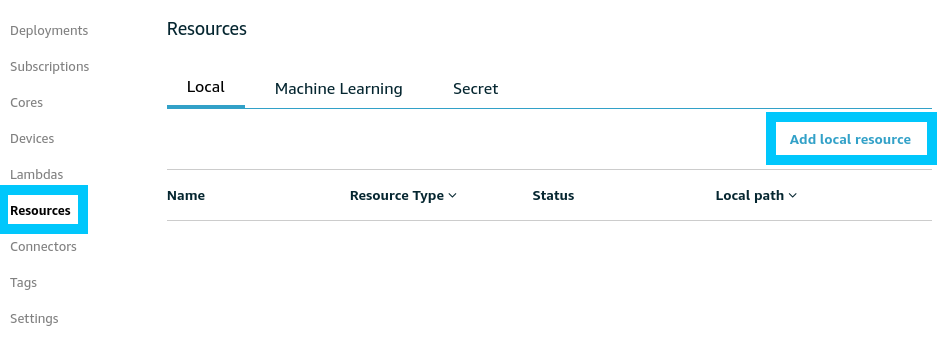
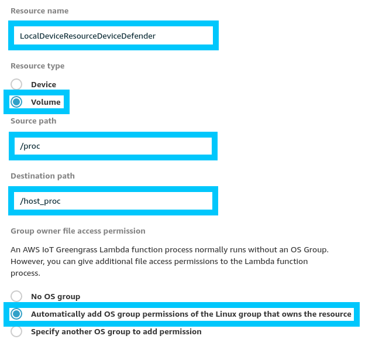
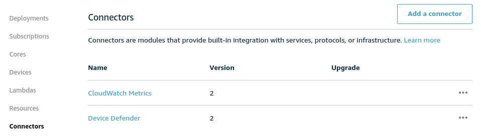
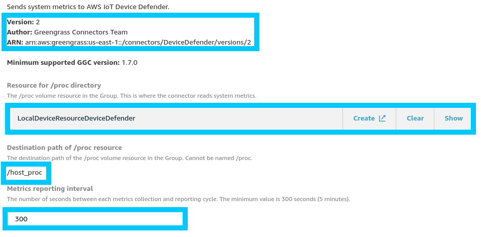

# Greener Grass - Device Defender - Detect

[AWS IoT Device Defender](https://aws.amazon.com/iot-device-defender/) provides a suite of options for Audit, Detection and Mitigation of IoT related security threats. While you are able to benefit by just using the default settings; there is so much more that can be accomplished if you dig a little deeper into the Device Defender offering.

In this post we dive into Detect; a sub feature of Device Defender Detect that allows you to craft your own detection profiles using both cloud-side and device-side metrics.

## Requirements

This post is part of a larger series where we delve into some of the more advanced features of AWS IoT Greengrass. The code in the [t04glovern/aws-greener-grass](https://github.com/t04glovern/aws-greener-grass) will help boostrap all the resources you will need to run this portion of the tutorials. If you would like the most seamless learning experience, ensure you have completed the following posts

* [Greener Grass - Greengrass Device Setup](../device-setup/README.md)

Don't worry if you aren't able to deploy! The information below doesn't contain anything specific to our environment.

## Device Defender Detect

### Service Introduction

Device Defender Detect helps you identify abnormal behaviour by interpreting cloud-side and device-side metrics from your IoT Devices. Detect relies on an agent running on the device to publish metrics on network usage statistics. These statistics when paired with the cloud-side stats; can begin to paint a picture of the security of a given device.

Some typical security incidents that Device Defender Detect might be able to report on are:

* Denial of Service attacks
* Participation in a Botnet
* Data exfiltration
* Incorrect device configuration
* Remote management ports open

### Detect Metrics

The metrics that are interpreted are low level and predominantly network related. Because of this it is our responsibility to publish these datapoints ourselves to topics on our Thing. The two topics used by Device Defender are:

```bash
$aws/things/THING_NAME/Defender/metrics/json
$aws/things/THING_NAME/Defender/metrics/cbor
```

The structure of the metric message can be seen below. If you need more details on what is or isn't required in the JSON sent, [please refer to the offical documentation](https://docs.aws.amazon.com/iot/latest/developerguide/device-defender-detect.html#DetectMetricsMessages)

```json
{
    "header": {
        "report_id": 1530304554,
        "version": "1.0"
    },
    "metrics": {
        "listening_tcp_ports": {
            "ports": [{"interface": "eth0", "port": 22}],
            "total": 1
        },
        "listening_udp_ports": {
            "ports": [{"interface": "eth0", "port": 5353}],
            "total": 1
        },
        "network_stats": { "bytes_in": 29358693495, "bytes_out": 26485035, "packets_in": 10013573555, "packets_out": 11382615
        },
        "tcp_connections": {
            "established_connections": {
                "connections": [{"local_interface": "eth0", "local_port": 80, "remote_addr": "192.168.0.1:8000"}],
                "total": 1
            }
        }
    }
}
```

There is an offical SDK for running the agent available for both:

* [python](https://github.com/aws-samples/aws-iot-device-defender-agent-sdk-python)
* [c](https://github.com/aws-samples/aws-iot-device-defender-agent-c)

The general idea is that a status update should be published regularly; AWS IoT documentation recommends every 5 minutes to avoid trottling.

### Device Defender Connector

You are probably saying to yourself "Ok, that seems a little difficult, is there a simple way to publish metrics?". The answer is actually Yes!, assuming you are running Greengrass. Connectors are turnkey packages that can run on your Greengrass Core for you with a few simple clicks. There are [quite a number of connectors](https://docs.aws.amazon.com/greengrass/latest/developerguide/connectors.html) available, however for this post we will be focusing on the [Device Defender Connector](https://docs.aws.amazon.com/greengrass/latest/developerguide/device-defender-connector.html).

The connector just a lambda that encapsultates all the work mentioned above around publishing metrics, however it is fully managed for you on Greengrass.

#### Connector Dependencies

Unfortunately there are a couple small packages that have to be installed on the Greengrass Core yourself. These are documented under the [requirements section](https://docs.aws.amazon.com/greengrass/latest/developerguide/device-defender-connector.html#device-defender-connector-req) of the connector however it boils down to running the following:

```bash
pip install psutil
pip install cbor
```

The `/proc` path also needs to be exposed as a local volume resource. If you deployed your Greengrass device using the code in [t04glovern/aws-greener-grass](https://github.com/t04glovern/aws-greener-grass) then by default all this configuration would have been done for you. If you need to perform these steps yourself; navigate to the `Resources` section of your Greengrass Core



Create a new local resource and setup the following settings



Once that's complete move onto the next step where we'll begin to configure our Device Defender Connector

#### Connector Deployment

If you used the deployment in [t04glovern/aws-greener-grass](https://github.com/t04glovern/aws-greener-grass) then the connector deployment also would have been setup for you as well. If you want to perform this step yourself; navigate to the `Connectors` section of your Greengrass Core



Create a new connector of type Device Defender with the following configuration

**Note**: The Resource directory for `/proc` should be pointed to the Local Resource created in the previous step.



When the next deployment of your Greengrass Core happens the Device Defender Connector will be brought up and should start logging metrics every 5 minutes.

### Security Profiles

Now that metrics are flowing in, we have to start creating some security profiles that define what bad behaviour looks like.
