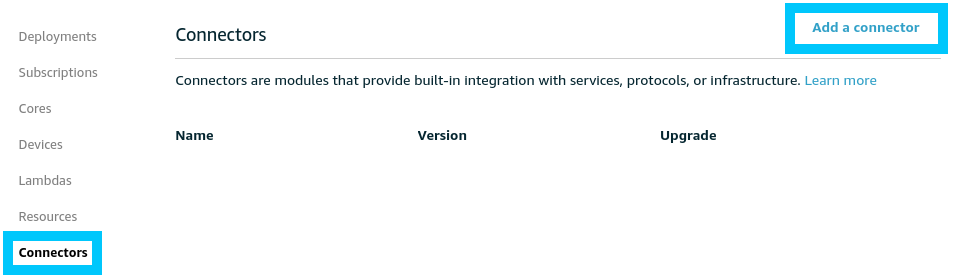
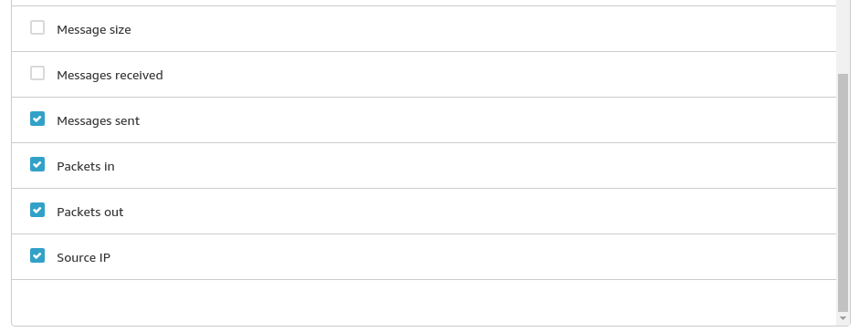
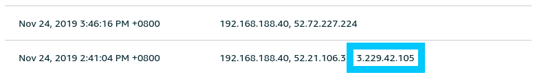

# Greengrass - Device Defender - Detect

[AWS IoT Device Defender](https://aws.amazon.com/iot-device-defender/) provides a suite of options for Audit, Detection and Mitigation of IoT related security threats. While you are able to benefit by just using the default settings; there is so much more that can be accomplished if you dig a little deeper into the Device Defender offering.

In this post we dive into Detect; a sub feature of Device Defender Detect that allows you to craft your own detection profiles using both cloud-side and device-side metrics.

## Requirements

This post is part of a larger series where we delve into some of the more advanced features of AWS IoT Greengrass. The code in the [t04glovern/aws-greener-grass](https://github.com/t04glovern/aws-greener-grass) will help boostrap all the resources you will need to run this portion of the tutorials. If you would like the most seamless learning experience, ensure you have completed the following posts

* [Greengrass - Greengrass Device Setup](../device-setup/README.md)

Don't worry if you aren't able to deploy! The information below doesn't contain anything specific to our environment.

## Device Defender Detect

### Service Introduction

Device Defender Detect helps you identify abnormal behaviour by interpreting cloud-side and device-side metrics from your IoT Devices. Detect relies on an agent running on the device to publish metrics on network usage statistics. These statistics when paired with the cloud-side stats; can begin to paint a picture of the security of a given device.

Some typical security incidents that Device Defender Detect might be able to report on are:

* Denial of Service attacks
* Participation in a Botnet
* Data exfiltration
* Incorrect device configuration
* Remote management ports open

### Detect Metrics

The metrics that are interpreted are low level and predominantly network related. Because of this it is our responsibility to publish these data-points ourselves to topics on our Thing. The two topics used by Device Defender are:

```bash
$aws/things/THING_NAME/Defender/metrics/json
$aws/things/THING_NAME/Defender/metrics/cbor
```

The structure of the metric message can be seen below. If you need more details on what is or isn't required in the JSON sent, [please refer to the offical documentation](https://docs.aws.amazon.com/iot/latest/developerguide/device-defender-detect.html#DetectMetricsMessages)

```json
{
    "header": {
        "report_id": 1530304554,
        "version": "1.0"
    },
    "metrics": {
        "listening_tcp_ports": {
            "ports": [{"interface": "eth0", "port": 22}],
            "total": 1
        },
        "listening_udp_ports": {
            "ports": [{"interface": "eth0", "port": 5353}],
            "total": 1
        },
        "network_stats": { "bytes_in": 29358693495, "bytes_out": 26485035, "packets_in": 10013573555, "packets_out": 11382615
        },
        "tcp_connections": {
            "established_connections": {
                "connections": [{"local_interface": "eth0", "local_port": 80, "remote_addr": "192.168.0.1:8000"}],
                "total": 1
            }
        }
    }
}
```

There is an offical SDK for running the agent available for both:

* [python](https://github.com/aws-samples/aws-iot-device-defender-agent-sdk-python)
* [c](https://github.com/aws-samples/aws-iot-device-defender-agent-c)

The general idea is that a status update should be published regularly; AWS IoT documentation recommends every 5 minutes to avoid throttling.

### Device Defender Connector

You are probably saying to yourself "Okay, that seems a little difficult, is there a simple way to publish metrics?". The answer is actually Yes!, assuming you are running Greengrass. Connectors are turnkey packages that can run on your Greengrass Core for you with a few simple clicks. There are [quite a number of connectors](https://docs.aws.amazon.com/greengrass/latest/developerguide/connectors.html) available, however for this post we will be focusing on the [Device Defender Connector](https://docs.aws.amazon.com/greengrass/latest/developerguide/device-defender-connector.html).

The connector just a lambda that encapsulates all the work mentioned above around publishing metrics, however it is fully managed for you on Greengrass.

#### Connector Dependencies

Unfortunately there are a couple small packages that have to be installed on the Greengrass Core yourself. These are documented under the [requirements section](https://docs.aws.amazon.com/greengrass/latest/developerguide/device-defender-connector.html#device-defender-connector-req) of the connector however it boils down to running the following:

```bash
pip install psutil
pip install cbor
```

**NOTE**: *If you are running on a Raspberry Pi (ARM based) or an architecture that isn't x86 you will also need to install the Device Defender SDK yourself*

```bash
pip install AWSIoTDeviceDefenderAgentSDK
```

The `/proc` path also needs to be exposed as a local volume resource. If you deployed your Greengrass device using the code in [Greener Grass - Greengrass Device Setup](../device-setup/README.md) then by default all this configuration would have been done for you. If you need to perform these steps yourself; navigate to the `Resources` section of your Greengrass Core


Create a new local resource and setup the following settings


Once that's complete move onto the next step where we'll begin to configure our Device Defender Connector.

#### Connector Deployment

If you used the deployment in [Greener Grass - Greengrass Device Setup](../device-setup/README.md) then the connector deployment also would have been setup for you as well. If you want to perform this step yourself; navigate to the `Connectors` section of your Greengrass Core



Create a new connector of type Device Defender with the following configuration.

**Note**: The Resource directory for `/proc` should be pointed to the Local Resource created in the previous step.


When the next deployment of your Greengrass Core happens the Device Defender Connector will be brought up and should start logging metrics every 5 minutes.

### Security Profiles

Now that metrics are flowing in, we have to start creating some security profiles that define what bad behaviour looks like.

In the follow section we'll explore a use case and setup a profile via the GUI and the CLI.

#### Data Exfiltration Check GUI

The first rule we will setup is a data exfiltration check. This rule is setup to detect anomilies in the amount of outbounch traffic coming off the device.

Think of the following scenario where a bad actor connects to your device somehow and begins to either mirror or send data to their own server. We want to setup a rule that detects a variation in the amount of traffic, and report information when the event does occur.

To create a new rule, navigate to [Device Defender > Detect > Security Profiles](https://console.aws.amazon.com/iot/home?region=us-east-1#/dd/securityProfilesHub) and create a new security profile.


The behavour creation screen might look confusing but when you break it down it is actually fairly simple. In our case we want to give our rule the basic name and description to start with.

* **Name**: DataExfiltrationCheck
* **Description**: Alerts on a possible data exfiltration attempt on devices

Under behaviour, we would like to setup an alert that triggers on the number of **Packets out** when there's a statistical anomaly that is greater then the usual traffic. To accomplish this the following options are set:

* **Name**: PacketExfiltration
* **Metric**: Packets out
* **Check Type**: Statistical Threshold
* **Operator**: Greater than
* **Statistical Threshold**: p99.99 (however feel free to change this based on the consistency of the data flows you work with)
* **Duration**: 5 minutes
* **Datapoints to Alarm**: 1
* **Datapoints to Clear**: 1

The idea is that if there is a significant change in data flows outbound that occurs over 5 minutes, fire off a security alarm after one instance of this. The alarm will clear after one cycle of 5 minutes where the anomaly doesn't occur.


The next piece of information that will be asked for is the Additional Metrics to retains. These selected metrics are data points that will be plotted for you automatically when digging into a security event. Usually it's a good idea to select metrics that are likely to be helpful while investigation is actioned.

For our use-case we select the following:

* Connection attempts
* Destination IPs
* Messages sent
* Packets in
* Packets out
* Source IP



Click next and you will be provided with options to define SNS topics that can be triggered when this security event fires. For now this is out of scope of this tutorial so we will skip it.

Finally you will need to define what you would like to attach the security profile to. In this case we would like to attach it to **All things**.


Hit next, and Save the rule for it to be put into effect.

#### Data Exfiltration Check CLI

The steps above are very manual, so you'll be happy to know that this can all be scripted by using `aws-cli` commands. Sometime in the future hopefully we also get CloudFormation support!

To create a security profile for the information above, save the following json to a file called something like `rule.json`

```json
{
    "securityProfileName": "DataExfiltrationCheck",
    "securityProfileDescription": "Alerts on a possible data exfiltration attempt on devices",
    "behaviors": [
        {
            "name": "PacketExfiltration",
            "metric": "aws:all-packets-out",
            "criteria": {
                "comparisonOperator": "greater-than",
                "durationSeconds": 300,
                "consecutiveDatapointsToAlarm": 1,
                "consecutiveDatapointsToClear": 1,
                "statisticalThreshold": {
                    "statistic": "p99.99"
                }
            }
        }
    ],
    "additionalMetricsToRetain": [
        "aws:num-connection-attempts",
        "aws:destination-ip-addresses",
        "aws:all-packets-out",
        "aws:all-packets-in",
        "aws:source-ip-address",
        "aws:num-messages-sent"
    ]
}
```

Run the following command to create the security profile defined in the json file.

```bash
aws iot create-security-profile --cli-input-json file://rule.json
# {
#     "securityProfileName": "DataExfiltrationCheck",
#     "securityProfileArn": "arn:aws:iot:us-east-1:123456789012:securityprofile/DataExfiltrationCheck"
# }
```

Then attach the profile to a thing group, in our case we want to attach it to all things.

```bash
aws iot attach-security-profile \
    --security-profile-name "DataExfiltrationCheck" \
    --security-profile-target-arn "arn:aws:iot:us-east-1:123456789012:all/things"
```

### Explore Violation

When a violation occurs we are able to view the event history under the Violations tab of the thing.


If you click into the transition values you are able to explore a breakdown of the metrics at any point in time during and after the violation occurred. Below is an example of the Packets out metric during a violation. This gives us a good indication of when the exfiltration of data took place.


Perhaps we not want to view the destination IP addresses of the traffic during the time of the event. We can do this by switching to the Destination IPs metrics and find a list of the IPs the device called out to.



## What's Next

From here you can begin to design a number of different security profiles for your organisation. Running these profiles aren't especially expensive so the way I see it, it's worth having a few core rules enabled.

Look out for a future post on how we can setup some simple alerting for Device defender, and then even mitigate problems automatically using Mitigation actions.
