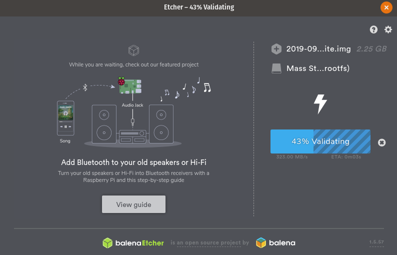

# Greengrass - Device Setup - Raspberry Pi

For this deployment we'll be describing how to setup Greengrass Core on a Raspberry Pi. This post is an extension of a larger series called Greener Grass, and once these steps have been completed please refer back to that guide to continue your learning.

Start of by downloading the [Rasbian lite image](https://www.raspberrypi.org/downloads/raspbian/). This can be done using `wget` if you are that way inclined.

```bash
wget https://downloads.raspberrypi.org/raspbian_lite/images/raspbian_lite-2019-09-30/2019-09-26-raspbian-buster-lite.zip
```

## Burn Image

Next we need to burn the image with [Etcher](https://www.balena.io/etcher/) or a similar imaging software.



Once the MicroSD card is flashed with Rasbian continue to the next step.

## Setup WiFi

Setting up WiFi and SSH access in a headless fashion is really useful if you haven't got a monitor around. It's already very convenient for bulk deployments.

This might be different based on your OS, the general idea is that you will need to create:

* An empty file called `ssh` in the `/boot/` partition
* A file called `wpa_supplicant.conf` in the same partition

```bash
touch /Volumes/boot/ssh
touch /Volumes/boot/wpa_supplicant.conf
nano /Volumes/boot/wpa_supplicant.conf

# Add the following config
country=AU
ctrl_interface=DIR=/var/run/wpa_supplicant GROUP=netdev
update_config=1

network={
    ssid="NETWORK-NAME"
    psk="NETWORK-PASSWORD"
}
```

**NOTE**: *Be sure to update your WiFi networking information. If you are using Ethernet you can skip the wpa_supplicant.conf step.*

## Connect to Pi

Plugin the Raspberry Pi and give it a couple minutes to first boot up. You can then SSH into your raspberry pi by either using [Putty](https://www.putty.org/) on Windows or `ssh` on MacOS & Unix

```bash
ssh-keygen -R raspberrypi.local
ssh pi@raspberrypi.local
# password: raspberry
```

Once connected, we update the system with the latest packages and install [Python Pip](https://pypi.org/project/pip/) for later use with the Greengrass SDK.

```bash
sudo apt-get update -y
sudo apt-get upgrade -y
sudo apt-get install python-pip -y
```

## Prepare for Greengrass

Now we need to perform a set of steps that are best described in the [official AWS setup guide for the Raspberry Pi](https://docs.aws.amazon.com/greengrass/latest/developerguide/setup-filter.rpi.html) These steps are highly recommended if you want to ensure you don't run into problems later down the track when running Greengrass Core.

Start off by adding a new system user and group that Greengrass will use when executing. This helps separate the permissions away from our default user.

```bash
# Create user and group
sudo adduser --system ggc_user
sudo addgroup --system ggc_group
```

Next we can enable hardlink and softlink (symlink) protection by editing `98-rpi.conf`.

```bash
sudo nano /etc/sysctl.d/98-rpi.conf
```

Add the following lines to the file:

```bash
fs.protected_hardlinks = 1
fs.protected_symlinks = 1
```

Reboot the pi, and when logged back in confirm the settings were set

```bash
sudo reboot
sudo sysctl -a 2> /dev/null | grep fs.protected
```

Edit your command line `/boot/cmdline.txt` file to enable and mount memory cgroups. Append the following to the single line

```bash
cgroup_enable=memory cgroup_memory=1
```

The file should look like the following (with some changes to partition for example)

```bash
console=serial0,115200 console=tty1 root=PARTUUID=6c586e13-02 rootfstype=ext4 elevator=deadline fsck.repair=yes rootwait cgroup_enable=memory cgroup_memory=1
```

Finally reboot the Pi again to confirm everything comes up okay.

```bash
sudo reboot
```

### Greengrass Dependency Checker

To confirm that all prerequisites are fulfilled we'll use the [Greengrass Dependency Checker](https://github.com/aws-samples/aws-greengrass-samples). Run the following commands from the home directory of the Raspberry Pi we SSH'd into.

```bash
mkdir /home/pi/Downloads && cd /home/pi/Downloads
mkdir greengrass-dependency-checker-GGCv1.10.x && cd greengrass-dependency-checker-GGCv1.10.x
wget https://github.com/aws-samples/aws-greengrass-samples/raw/master/greengrass-dependency-checker-GGCv1.10.x.zip
unzip greengrass-dependency-checker-GGCv1.10.x.zip && cd greengrass-dependency-checker-GGCv1.10.x
sudo modprobe configs
sudo ./check_ggc_dependencies | more
```

There will likely be a couple warnings when running:

* It looks like the kernel uses 'systemd' as the init process.
* Could not find the binary 'nodejs8.10'.
* Could not find the binary 'java8'.

These are safe to ignore for now, the first warning should be kept in mind however as we'll resolve it later.

## Download Greengrass Core

Depending on what version your raspberry pi is will determine what version we'll need. Run the following command to get your architecture.

```bash
uname -a
# Linux raspberrypi 4.19.75+ #1270 Tue Sep 24 18:38:54 BST 2019 armv6l GNU/Linux
```

In this case my architecture is `armv6l` so from the [Greengrass download page download](https://docs.aws.amazon.com/greengrass/latest/developerguide/what-is-gg.html#gg-core-download-tab) the distribution for rasbian that matches this

```bash
# Download the `armv6l` tar
wget https://d1onfpft10uf5o.cloudfront.net/greengrass-core/downloads/1.10.0/greengrass-linux-armv6l-1.10.0.tar.gz
```

Now that we have the files we need, copy them all to the Raspberry Pi

```bash
scp greengrass-linux-armv6l-1.10.0.tar.gz pi@raspberrypi.local:/home/pi
```

## Extract Greengrass Files

SSH back onto the Raspberry Pi and extract the two file bundles we just downloaded by running the following

```bash
sudo tar -xzvf greengrass-linux-armv6l-1.10.0.tar.gz -C /
```

Confirm everything copied across correctly by running the following

```bash
ls -al /greengrass
# drwxr-xr-x  6 root root 4096 Aug 31 04:40 .
# drwxr-xr-x 22 root root 4096 Aug 31 04:40 ..
# drwxr-xr-x  3 root root 4096 Aug 31 04:40 ggc
# drwxr-xr-x  3 root root 4096 Aug 31 04:40 ota
```

## Summary

The Raspberry Pi is now setup and configured with Greengrass and ready for certificates to authenticate it with AWS IoT. For information on how to do this, please return to the previous post:

* [Greengrass - Greengrass Device Setup](../device-setup/README.md)
