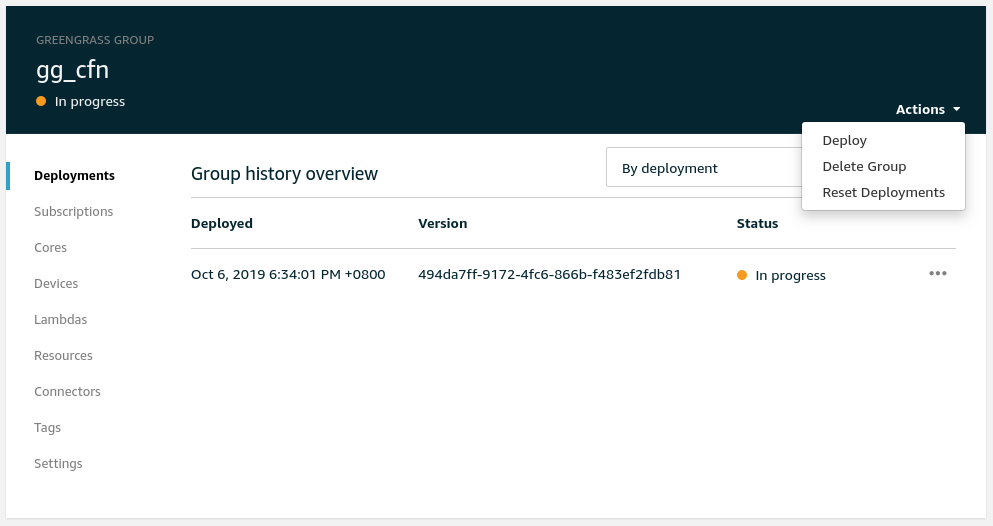

# Greener Grass - Device Setup

AWS IoT Greengrass is a managed service that allows you to easily manage and communicate with edge devices. It sells itself as a central way to deploy to huge fleets of devices in a repeatable way.

The irony of this is that deploying the foundation of AWS Greengrass can be quite complex and messy. In the official guide for Greengrass Core, AWS recommends using the Easy Creation button. This is perfectly fine for testing purposes, however if you are deploying production workloads then repeatability is really key.

**NOTE**: This post is a rehash of an existing post [AWS IoT Greengrass CloudFormation – Raspberry Pi](https://devopstar.com/2019/10/07/aws-iot-greengrass-cloudformation-raspberry-pi/).

The goal of this post is to deploy a learning environment called Greener Grass that effectively boostraps all the AWS IoT and Greengrass configuration for you. This allows you to be able to learn about the advanced IoT features in a friendly & repeatable way.

## Prerequisites

* AWS Account with [AWS CLI Setup](https://docs.aws.amazon.com/cli/latest/userguide/cli-chap-configure.html)
* Edge Device, in the case of this post I'm using an [Raspberry Pi](https://www.raspberrypi.org/products/)
* Clone [t04glovern/aws-greener-grass](https://github.com/t04glovern/aws-greener-grass) locally
* [NodeJS](https://nodejs.org/en/download/) installed for [AWS CDK](https://github.com/aws/aws-cdk)

## Setting up a Device

Although this guide follows the setup of the Raspberry Pi, It is worth noting that the process is similar for just about any other system you'd like to run Greengrass on also.

To setup the device you are using with Greengrass, refer to one of the following guides before moving forward:

* [Greener Grass - Device Setup - Raspberry Pi](../device-setup-raspberry-pi/README.md)

## Deploying Greener Grass

With our device successfully ready with Greengrass installed, it is now time to create an AWS IoT Greengrass Core. While the process can definitely be [done through the UI](https://console.aws.amazon.com/iot/home) we will instead be using [AWS CDK](https://docs.aws.amazon.com/cdk/latest/guide/home.html) to deploy our Greengrass device so that management can be done entirely through code.

**What is CDK?:** *CDK or Cloud Development Kit is a software development framework for defining cloud resources and provisioning through CloudFormation. It effectively means we can define things in the cloud through code!*

Start by pulling down the repository that houses the CDK project from [t04glovern/aws-greener-grass](https://github.com/t04glovern/aws-greener-grass)

```bash
git clone https://github.com/t04glovern/aws-greener-grass
```

Then install AWS CDK via NodeJS (if you haven't got NodeJS, [install it via their downloads page](https://nodejs.org/en/download/)).

```bash
npm install -g aws-cdk
```

Next change into the `cdk` folder of the project we just clone and install the project dependencies. At this stage we will also compile the CDK typescript.

```bash
cd cdk
npm install

# You might want to keep `watch` running in another terminal
npm run watch
```

Finally, deploy the Greener Grass stack by executing the `./deploy.sh` script.

**NOTE:** *If you would like to rename the device from the default `lila`, change the `THING_NAME` variable at the top of [./deploy.sh](../../cdk/deploy.sh)*

## Certificate Install on Device

Part of the deploy script above would have compressed all the certificates from the Greengrass device deploy and placed them into the `cdk` directory. We now need to install these in order to register our device with AWS IoT.

Ensure to replace:

* **user** - with your device login account
* **device** - with the hostname or IP of the device

```bash
# Change back into the cdk directory if you exited
cd cdk

# Copy the device certificate bundle
scp *-setup.tar.gz user@device:/home/user
# Copy a seervice script that will help us install things
scp deploy-service.sh user@device:/home/user
```

### Extract Greengrass Files

SSH back onto the device and extract the bundles we just downloaded by running the following

```bash
sudo tar -xzvf <DEVICE_NAME>-setup.tar.gz -C /greengrass
```

Confirm everything copied across correctly by running the following

```bash
ls -al /greengrass
# drwxr-xr-x  6 root root 4096 Aug 31 04:40 .
# drwxr-xr-x 22 root root 4096 Aug 31 04:40 ..
# drwxrwxr-x  2 user user 4096 Oct  6 18:01 certs
# drwxrwxr-x  2 user user 4096 Oct  6 18:01 config
# drwxr-xr-x  3 root root 4096 Aug 31 04:40 ggc
# drwxr-xr-x  3 root root 4096 Aug 31 04:40 ota
```

Next we also need to download the ATS root CA certificate into `/greengrass/certs`

```bash
cd /greengrass/certs/
sudo wget -O root.ca.pem https://www.amazontrust.com/repository/AmazonRootCA1.pem
```

### Greengrass Start

With all the files in the right places on the device, it's now time to try to start the service

```bash
cd /greengrass/ggc/core/
sudo ./greengrassd start
```

You should see a Greengrass successfully started message. Take note of the PID of the process so we can view the status of the daemon

```bash
ps aux | grep PID_NUMBER
# root       761  2.4  3.0 854472 13508 pts/0    Sl   18:18   0:01 /greengrass/ggc/packages/1.9.4/bin/daemon -core-dir /greengrass/ggc/packages/1.9.4 -greengrassdPid 757
```

To setup Greengrass on startup, run the following (note this will reboot your device). **This assumes that you are using systemd**.

```bash
sudo ./deploy-service.sh
```

### Greengrass SDK

If you don't want to bundle the [greengrasssdk](https://pypi.org/project/greengrasssdk/) in with your application, you can install it globally

**NOTE:** this step might be different depending on how your device had Python installed on it to begin with.

```bash
sudo pip install greengrasssdk
```

If you choose not to go down this route you can manually bundle `greengrasssdk` in with your lambda deployments in the future.

### Greengrass Deploy [CLI]

To create our first deployment we first need to retrieve our Greengrass Group ID

```bash
aws greengrass list-groups
# {
#     "Groups": [
#         {
#             "Arn": "arn:aws:greengrass:us-east-1:123456789012:/greengrass/groups/..........",
#             "CreationTimestamp": "2019-10-06T10:31:53.950Z",
#             "Id": "41752ff2-54e5-49e9-8751-d489e3e6fa1f",
#             "LastUpdatedTimestamp": "2019-10-06T10:31:53.950Z",
#             "LatestVersion": "1c578332-44f7-411b-9ebb-1139fa1e453a",
#             "LatestVersionArn": "arn:aws:greengrass:us-east-1:123456789012:/greengrass/groups/..........",
#             "Name": "gg_cfn"
#         }
#     ]
# }
```

In my case the group ID and version can be seen above, simply substitute it into the following command to kick off your first deployment

```bash
aws greengrass create-deployment \
    --deployment-type NewDeployment \
    --group-id "41752ff2-54e5-49e9-8751-d489e3e6fa1f" \
    --group-version-id "1c578332-44f7-411b-9ebb-1139fa1e453a"
```

### Greengrass Deployment [GUI]

To deploy through the GUI, navigate to the [AWS IoT Greengrass portal](https://us-east-1.console.aws.amazon.com/iot/home?region=us-east-1#/greengrass/groups) and kick off a new deployment under the Greengrass group we just created



## Greengrass Cleanup

Once you're finished working with Greengrass it's really easy to cleanup the AWS resources we used. Run the following command to destroy the CDK stack

```bash
cdk deploy --context=device_name=${THING_NAME}
```
