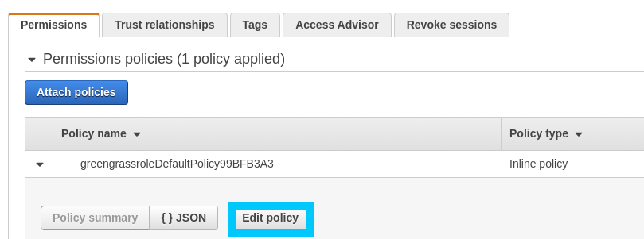

# Greener Grass - Docker Deployments

AWS IoT Greengrass recently got Docker support; a much needed addition to the suite of edge tooling available at our disposal. As with most new IoT Greengrass feature, it can be a bit bumped to get setup with. I would know, I fought through the setup process on the day of release and ran into a couple quirks that I figure I'll share with the world in the form of an unofficial guide.

What you will learn if you read this guide:

* **Installing Docker & docker-compose** onto a Raspberry Pi device
* Learn **what dependencies you will need installed** on non Raspberry Pi devices, and how to find guides for those installations
* How to **configure the Docker Application Deployment Connector** for IoT Greengrass
* Optionally learn how the deployment process can be codified with [AWS CDK](https://docs.aws.amazon.com/cdk/latest/guide/home.html)

## Requirements

This post is part of a larger series where we delve into some of the more advanced features of AWS IoT Greengrass. The code in the [t04glovern/aws-greener-grass](https://github.com/t04glovern/aws-greener-grass) will help bootstrap all the resources you will need to run this portion of the tutorials. If you would like the most seamless learning experience, ensure you have completed the following posts

* [Greener Grass - Greengrass Device Setup](../device-setup/README.md)

The information below doesn't contain anything super specific to our environment. Once you have a basic device setup and connected to Greengrass, you'll be able to continue with this guide.

## Docker Application Deployment Connector

Under the hood Docker deployments for Greengrass are just made up of a lambda function orchestrating docker-compose commands for you. This process is bundled up into what's called a [Greengrass Connector](https://docs.aws.amazon.com/greengrass/latest/developerguide/connectors-list.html).

There are many connectors available, however the one we're interested in is [Docker Application Deployment](https://docs.aws.amazon.com/greengrass/latest/developerguide/docker-app-connector.html). If you take a look at the requirements for this connector you can begin to see what we will need installed on our Greengrass core device.

* **AWS IoT Greengrass Core v1.10**
  * Should be covered if you've installed Greengrass recently
* **Python 3.7**
  * If running python3.6 instead, upgrade using a relevant guide for your OS
* **A minimum of 36 MB RAM**
  * Hopefully this isn't an issue for you. Note Docker might not always be the best approach.
* **Docker Engine v1.9.1**
  * We'll cover this below
* **Docker Compose**
  * We'll cover this below
* **Linux user with docker daemon permissions**
  * `sudo usermod -aG docker USERNAME` should suffice, but check below beforehand.

For the remaining requirements, I'll hold off discussing them until later in the guide.

## Install Dependencies

The first step is arguably the most difficult (depending on what platform you are using). We need to install [Docker](https://docs.docker.com/install/) and [docker-compose](https://docs.docker.com/compose/) onto our Greengrass Core.

**NOTE**: _Since most of the complexity around getting Docker installed come from the ARM platforms (Raspberry Pi), I've included this setup in the guide. For x86_64 architectures, following the standard documentation (linked below) should work fine._

### Install Docker [Raspberry Pi]

Docker is obviously required for this tutorial, however depending on what device you are using will determine how you install Docker.

I recommend referring to the offical [Docker installation documentation here](https://docs.docker.com/v17.09/engine/installation/linux/docker-ce/debian/#set-up-the-repository), however if you are running a Raspberry Pi you can try the commands below:

```bash
# Preinstall some requirements
sudo apt-get install \
    apt-transport-https \
    ca-certificates \
    software-properties-common \
    curl

# Use the get-docker script
curl -fsSL get.docker.com -o get-docker.sh && sh get-docker.sh

# Add pi & ggc_user to docker group
# NOTE the pi user is only for Raspberry Pi, and is also optional
sudo usermod -aG docker pi
sudo usermod -aG docker ggc_user

# Import Docker’s official GPG key
curl -fsSL https://download.docker.com/linux/$(. /etc/os-release; echo "$ID")/gpg | sudo apt-key add -

# Confirm the import
sudo apt-key fingerprint 0EBFCD88

# Add docker mirror to sources list
echo "deb https://download.docker.com/linux/raspbian/ stretch stable" | \
    sudo tee /etc/apt/sources.list.d/docker.list

# Update and Upgrade
sudo apt-get update
sudo apt-get upgrade

# Start the docker service (if it isn't already running)
systemctl start docker.service
```

### Install docker-compose [Raspberry Pi]

The CLI command docker-compose is also required for the Docker connector to function. This can be installed again by following the [offical documentation on the docker website](https://docs.docker.com/compose/install/)

Most x86 systems should be able to be setup with the following commands, however if you are on Raspberry Pi (ARM), you will need to skip over these steps

```bash
# Download binary
sudo curl -L "https://github.com/docker/compose/releases/download/1.25.0/docker-compose-$(uname -s)-$(uname -m)" -o /usr/local/bin/docker-compose

# Change privleges
sudo chmod +x /usr/local/bin/docker-compose
```

As mentioned above, on **Raspberry Pi or other ARM devices** you might need to instead install via pip3

```bash
sudo apt-get install \
    libffi-dev \
    libssl-dev \
    python-backports.ssl-match-hostname \
    python3-pip

sudo pip3 install docker-compose
```

Test docker-compose by running the following

```bash
docker-compose -v
# docker-compose version 1.25.0, build b42d419
```

## Docker Connector Configuration

We are now at the point where we have all dependencies we need in order to deploy a docker connector to our device.

**NOTE**: *If you do a deployment using the [t04glovern/aws-greener-grass](https://github.com/t04glovern/aws-greener-grass) repository instead, you can skip deploying from the UI.*

### Greengrass Bucket Role

If you didn't deploy your Greengrass group with the [t04glovern/aws-greener-grass](https://github.com/t04glovern/aws-greener-grass) project, it's important that you edit the existing role with the privileges to pull from an S3 bucket.

**NOTE**: It's make sure you have an S3 bucket to use for storing the docker-compose file. This can be created either from the CLI by running the following:

```bash
aws s3 mb s3://unique-bucket-name
```

Alternatively you can [create a bucket from the UI](https://s3.console.aws.amazon.com/s3/home?region=us-east-1#). Next navigate to your Greengrass group and retrieve the role name attached to your device.


Go into the [IAM Role console](https://console.aws.amazon.com/iam/home?region=us-east-1#/roles) and find the role currently attached. Proceed to edit the policy attached to the role (or add a new policy if none exist).



Add the following JSON statement to the policy (merge in with any existing policy statements that might already exist).

```json
{
    "Version": "2012-10-17",
    "Statement": [
        {
            "Action": [
                "s3:GetObject*",
                "s3:GetBucket*",
                "s3:List*"
            ],
            "Resource": [
                "arn:aws:s3:::unique-bucket-name",
                "arn:aws:s3:::unique-bucket-name/*"
            ],
            "Effect": "Allow"
        }
    ]
}
```

Congratulations! You have now got a bucket and permissions that can be used to deploy docker-compose files to Greengrass Core.

### docker-compose file

To deploy docker containers to our device we first need a docker-compose file with a definition of the services we want to run. This docker-compose file should be placed into an S3 bucket that the Greengrass group has permissions to pull from.

Create a new `docker-compose.yml` file in the root of the bucket we created prior. Put the following contents in the file.

```yaml
version: '3.3'

services:
  ui:
    image: hypriot/rpi-dockerui
    restart: always
    volumes:
      - '/var/run/docker.sock:/var/run/docker.sock'
    expose:
      - 9000
    ports:
      - 80:9000
```

**NOTE**: *This particular docker-compose file is setup for ARM systems. If you are running x86_64 then replace the block above with [portainer](https://hub.docker.com/r/portainer/portainer/) instead.

```yaml
version: '3.3'

services:
  ui:
    image: portainer/portainer
    restart: always
    volumes:
      - '/var/run/docker.sock:/var/run/docker.sock'
    expose:
      - 9000
    ports:
      - 80:9000
```

### Add Docker Connector [UI]

Head to the Greengrass core connector section and click add new connector.


Create a new instance of the **Docker Application Deployment** connector and fill in the following details

* **Docker Compose file in S3**
  * Select the docker-compose file we created in the previous step
* **Directory path for local Compose file**
  * `/home/ggc_user` is the path that should make most sense if you followed this tutorial. If you do change the path you might need to also set the _Docker user ID_ field to be a user with the correct permissions to the path you specified.
* **Logging frequency**
  * 30 seconds, but this is optional and we only set it to get logs back to us more frequently.


To finish up configuration, click `Save` then under `Actions` select `Deploy`.


### Add Docker Connector [CDK]

If you are wondering how the connector can be deployed via CDK, check the [cdk/lib/connectors/docker-application-deployment.ts](../../cdk/lib/connectors/docker-application-deployment.ts) file in the [t04glovern/aws-greener-grass](https://github.com/t04glovern/aws-greener-grass) project.

```typescript
import cdk = require('@aws-cdk/core');
import greengrass = require('@aws-cdk/aws-greengrass');

export interface IDockerApplicationDeployment {
  deviceName: string;
  composeFileBucket: string;
  composeFileKey: string;
}

export class DockerApplicationDeployment extends cdk.Construct {

  public readonly property: greengrass.CfnConnectorDefinitionVersion.ConnectorProperty;

  constructor(scope: cdk.Construct, id: string, props: IDockerApplicationDeployment) {
    super(scope, id);

    this.property = {
      id: `${props.deviceName}-docker`,
      connectorArn: `arn:aws:greengrass:${cdk.Aws.REGION}::/connectors/DockerApplicationDeployment/versions/1`,
      parameters: {
        'DockerComposeFileS3Bucket': `${props.composeFileBucket}`,
        'DockerComposeFileS3Key': `${props.composeFileKey}`,
        'DockerComposeFileDestinationPath': '/home/ggc_user',
        'DockerContainerStatusLogFrequency': '30'
      }
    }
  }
}
```

This class simply takes a reference to the *docker-compose* file and location within the bucket. Then in the [cdk/lib/definitions/connector-definition.ts](../../cdk/lib/definitions/connector-definition.ts) file the connector is initialised.

```typescript
/**
 * Connector - Docker Application Deployment
 */
this.dockerBucket = new s3.Bucket(this, 'docker-application-bucket');
this.dockerBucket.grantRead(props.greengrassRole);
const docker_application_deployment = new DockerApplicationDeployment(this, 'docker-application-deployment', {
    deviceName: props.deviceName,
    composeFileBucket: this.dockerBucket.bucketName,
    composeFileKey: 'docker-compose.yml'
});
```

Finally in the same file at the bottom the connector is added to the connectors array as part of the ConnectorDefinition.

**NOTE**: *The reason for the array is that multiple connectors can be defined here for other types of connectors*

```typescript
this.def = new greengrass.CfnConnectorDefinition(this, 'greengrass-connector-def', {
    name: props.deviceName
});
this.version = new greengrass.CfnConnectorDefinitionVersion(this, 'greengrass-connector-def-version', {
    connectorDefinitionId: this.def.attrId,
    connectors: [
    docker_application_deployment.property
    ]
});
```

## Testing Docker Deployment

With the deployment successful we can confirm it is working a number of ways. The most obvious way is to SSH onto the Greengrass Core device and run the following docker commands to view the running containers.

```bash
docker ps -a
# CONTAINER ID        IMAGE                  COMMAND             CREATED             STATUS              PORTS                  NAMES
# ce050c5d4d44        hypriot/rpi-dockerui   "/dockerui"         25 seconds ago      Up 12 seconds       0.0.0.0:80->9000/tcp   greengrassdockerapplicationdeployment_ui_1
```

The preferred way to view the state is to check the [CloudWatch logs](https://console.aws.amazon.com/cloudwatch/home?region=us-east-1#logs:) that would have been created by the connector. Navigate to the CloudWatch logs page and find the log group for **DockerApplicationDeployment**. In my case it was called the following:

```yaml
Log Groups/aws/greengrass/Lambda/us-east-1/aws/DockerApplicationDeployment
```

The final way would be to navigate to your device name in a browser and you should be greeted with a container status page (might look differently if you deployed portainer instead).

```yaml
# Raspberry Pi
http://raspberrypi.local/

# Custom device
http://device-name/
```


## Conclusion

Docker is a powerful utility and having the ability to run containers on the edge is a great stepping stone forward. I would advise that you do make sure you can't achieve what you need in Lambda first before looking at containers however, as containers aren't always the best solution.

Thanks to the following guides for providing some extra insights to me while I was writing.

* [Visualize your Raspberry Pi containers with Portainer or UI for Docker](https://blog.hypriot.com/post/new-docker-ui-portainer/)
