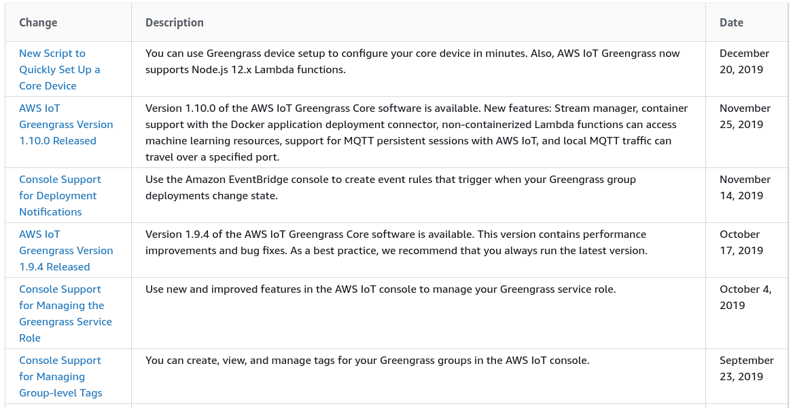

# Greengrass - Over The Air (OTA) Updates

## Introduction

When working with AWS IoT Greengrass offers a lot of great functionality for offloading computation to the edge. Greengrass however is software; and software will need to be patched and maintained just like everything else. In this port we will deep dive the process of performing over the air updates to your greengrass devices in a safe and repeatable manner.

## Prerequisites

It will help if you have setup the following:

* [AWS CLI](https://docs.aws.amazon.com/cli/latest/userguide/cli-chap-configure.html) installed and setup
* Have completed the device setup post: [Greengrass - Greengrass Device Setup](../device-setup/README.md)
  * If not this, then at-least know how to create AWS IoT certificates with a policy `iot*`
* Running and older version of Greengass is **technically optional** as OTA updates can be run ontop of existing configuration.

## Greengrass Versions

To start with I'll introduce you to Greengrass versions and how you can get information about what your devices might be running.

**NOTE**: *Currently there doesn't appear to be a way to retrieve the version of Greengrass from any APIs through the console. If someone has information that contradicts what I'm saying here please let me know!*

Connect to your device that is runnig Greengrass either by SSH or via a [Secure Tunnel](https://devopstar.com/2019/12/25/greengrass-secure-tunneling/).

```bash
# Example SSH
ssh pi@raspberrypi.local
```

Once connected print out the contents of the directory below to get the current installed version of Greengrass

```bash
ls -al /greengrass/ggc/packages/
# total 12
# drwxr-xr-x 3 root root 4096 Nov 25 21:52 .
# drwxr-xr-x 6 root root 4096 Dec 24 09:18 ..
# drwxr-xr-x 8 root root 4096 Dec 12 13:28 1.9.4
```

Alternatively you can also run the following to check what version of the daemon is running

```bash
ps -aux | grep greengrass
# root       494  0.1  1.5 909916 15132 ?        Sl   04:32   0:02 /greengrass/ggc/packages/1.9.4/bin/daemon -core-dir /greengrass/ggc/packages/1.9.4 -greengrassdPid 479
```

As seen above I am running Greengrass Core version **1.9.4**.

### Greengrass Changelogs

For tracking releases of Greengrass I recommend setting up a way to monitor the [Document History for AWS IoT Greengrass](https://docs.aws.amazon.com/greengrass/latest/developerguide/doc-history.html) page. When releases drop information about them can be viewed there first.

In our case version **1.10.0** is now available for upgrade so the goal for this post is to update our **1.9.4** core to the latest release.



## Greengrass Update

### ggc_ota Deamon

Unfortunately the Greengrass Core OTA daemon is not managed by Greengrass Core itself due to core needing to be replaced entirely by the `ggc-ota` agent. This means we have to start and manage the agent ourselves independently of Greengrass.

The way that the [documentation recommends](https://docs.aws.amazon.com/greengrass/latest/developerguide/core-ota-update.html#ota-agent) doing this is to run the ggc-ota agent when you need to perform OTA upgrades.

```bash
sudo /greengrass/ota/ota_agent/ggc-ota
```

You can check to confirm it is running by checking with the following command:

```bash
ps -aux | grep ggc-ota
# root      1220  0.3  0.3  14416  3600 ?        Ssl  05:26   0:00 /greengrass/ota/ota_agent/ggc-ota
```

### Greengrass Update Job

```bash
AWS_REGION="us-east-1"
ACCOUNT_ID=$(aws sts get-caller-identity | jq -r '.Account')

THING_NAME="thing_name"
THING_OS="raspbian" # ubuntu, amazon_linux, raspbian, openwrt
THING_ARCH="armv7l" # armv7l, armv6l, x86_64, aarch64
THING_SOFTWARE="core" # core, ota_agent

otaUpdateRole=$(aws cloudformation describe-stacks --stack-name greengrass-cdk \
    --query 'Stacks[0].Outputs[?OutputKey==`otaUpdateRole`].OutputValue' \
    --region ${AWS_REGION} \
    --output text)

aws greengrass create-software-update-job \
    --region ${AWS_REGION} \
    --update-targets-architecture ${THING_ARCH} \
    --update-targets arn:aws:iot:${AWS_REGION}:${ACCOUNT_ID}:thing/${THING_NAME} \
    --update-targets-operating-system ${THING_OS} \
    --software-to-update ${THING_SOFTWARE} \
    --update-agent-log-level DEBUG \
    --s3-url-signer-role ${otaUpdateRole}
```

Running the commands above should result in a job being created

```bash
# {
#     "IotJobArn": "arn:aws:iot:us-east-1:123456789012:job/GreengrassUpdateJob_12769eb7-327b-41b7-9cbb-1485eb4fe40f",
#     "IotJobId": "GreengrassUpdateJob_12769eb7-327b-41b7-9cbb-1485eb4fe40f",
#     "PlatformSoftwareVersion": "1.10.0"
# }
```
