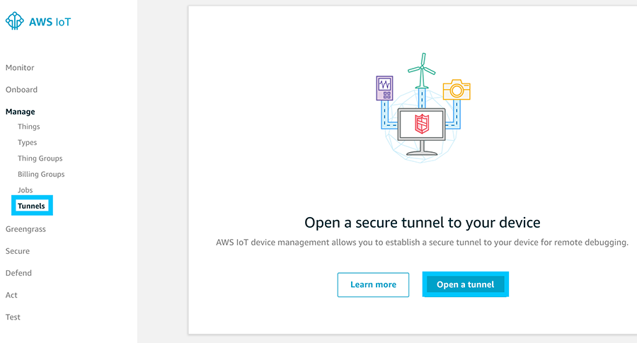
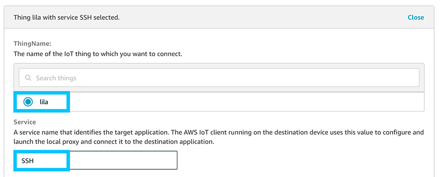
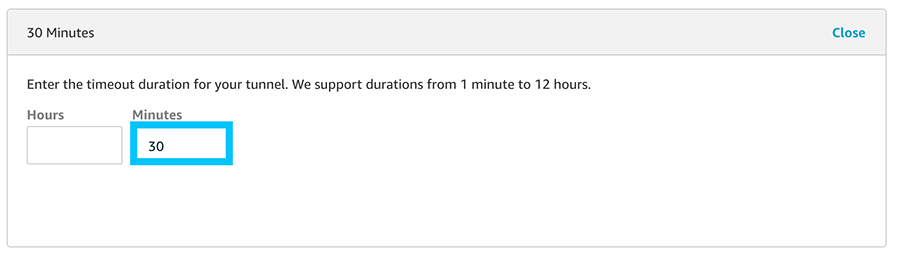

# Greengrass - Secure Tunnel

## Build localproxy

---

As usual we will be tackling this problem from the Raspberry Pi 3B+ (armv7l) perspective. I am actually shooting myself in the foot on purpose however, as the documentation for this process is extremely lacking currently.

Currently there are no mirriors of localproxy so you'll either have to:

* Build it yourself
* Use my pre-compiled mirrors

### Ubuntu (x86_64)

The [documentation for this compile](https://github.com/aws-samples/aws-iot-securetunneling-localproxy) should work however to save you sometime I've bundled the binaries and can be downloaded and installed from the following.

* [localproxy](https://github.com/t04glovern/aws-greener-grass/raw/master/.blog/greengrass-secure-tunnel/binaries/localproxy-x86_64)
* [localproxytest](https://github.com/t04glovern/aws-greener-grass/raw/master/.blog/greengrass-secure-tunnel/binaries/localproxytest-x86_64)

```bash
# Download binaries
wget https://github.com/t04glovern/aws-greener-grass/raw/master/.blog/greengrass-secure-tunnel/binaries/localproxy-x86_64 -O localproxy
wget https://github.com/t04glovern/aws-greener-grass/raw/master/.blog/greengrass-secure-tunnel/binaries/localproxytest-x86_64 -O localproxytest

# Copy binaries
sudo mv localproxy /usr/bin/localproxy
sudo mv localproxytest /usr/bin/localproxytest
```

### Raspberry Pi (armv7l)

Instructions for the Raspberry Pi (arm7l) compile can also be found in the [aws-iot-securetunneling-localproxy repository](https://github.com/aws-samples/aws-iot-securetunneling-localproxy). Before jumping into how to compile however, you can optionally jump in and use the binaries below.

* [localproxy](https://github.com/t04glovern/aws-greener-grass/raw/master/.blog/greengrass-secure-tunnel/binaries/localproxy-armv7l)
* [localproxytest](https://github.com/t04glovern/aws-greener-grass/raw/master/.blog/greengrass-secure-tunnel/binaries/localproxytest-armv7l)

```bash
# Download binaries
wget https://github.com/t04glovern/aws-greener-grass/raw/master/.blog/greengrass-secure-tunnel/binaries/localproxy-armv7l -O localproxy
wget https://github.com/t04glovern/aws-greener-grass/raw/master/.blog/greengrass-secure-tunnel/binaries/localproxytest-armv7l -O localproxytest

# Copy binaries
sudo mv localproxy /usr/bin/localproxy
sudo mv localproxytest /usr/bin/localproxytest
```

#### Install pre-requirements

```bash
sudo apt-get install cmake git
```

#### Install pre-compiled localproxy

```bash
# Zlib dependency
cd ~
wget https://www.zlib.net/zlib-1.2.11.tar.gz -O /tmp/zlib-1.2.11.tar.gz
tar xzvf /tmp/zlib-1.2.11.tar.gz
cd zlib-1.2.11
./configure
make
sudo make install

# Boost dependency
cd ~
wget https://dl.bintray.com/boostorg/release/1.69.0/source/boost_1_69_0.tar.gz -O /tmp/boost.tar.gz
tar xzvf /tmp/boost.tar.gz
cd boost_1_69_0
./bootstrap.sh
sudo ./b2 install

# Protobuf dependency
cd ~
wget https://github.com/protocolbuffers/protobuf/releases/download/v3.11.2/protobuf-all-3.11.2.tar.gz -O /tmp/protobuf-all-3.11.2.tar.gz
tar xzvf /tmp/protobuf-all-3.11.2.tar.gz
cd protobuf-3.11.2
mkdir build
cd build
cmake ../cmake
make
sudo make install

# OpenSSL development libraries
sudo apt install libssl-dev

# Catch2 test framework
cd ~
git clone https://github.com/catchorg/Catch2.git
cd Catch2
mkdir build
cd build
cmake ../
make
sudo make install

# localproxy build
cd ~
git clone https://github.com/aws-samples/aws-iot-securetunneling-localproxy
cd aws-iot-securetunneling-localproxy
mkdir build
cd build
cmake ../ -DCMAKE_CXX_FLAGS=-latomic
make

# Install binary
sudo cp bin/* /bin/
```

## localproxy Test

---

Now that the localproxy binary is installed you can run the preflight tests by running the following

```bash
localproxytest
# Test server is listening on address: 127.0.0.1 and port: 39985
# [2019-12-23 11:52:10.957851] [0x7616b3a0] [info]    Starting proxy in source mode
# [2019-12-23 11:52:10.972793] [0x7616b3a0] [trace]   Setting up web socket...
# [2019-12-23 11:52:10.973425] [0x7616b3a0] [info]    Attempting to establish web socket connection with endpoint wss://127.0.0.1:39985
# [2019-12-23 11:52:11.425299] [0x7696c3a0] [info]    Disconnected from: 127.0.0.1:34989
# ...
# ...
# ...
# [2019-12-23 11:52:11.425688] [0x7696c3a0] [trace]   Both socket drains complete. Setting up TCP socket again
# ===============================================================================
# All tests passed (32 assertions in 2 test cases)
```

## secure_tunnel Install

For a tunnel connection to be setup for us, we must create an IoT listener that triggers `localproxy` for us on request. For this I've written a simple block of code that an be found below.

```python
#!/usr/bin/python3

import argparse
import boto3
import botocore.exceptions
import logging
import json
import random
import string
import subprocess
import time

from AWSIoTPythonSDK.MQTTLib import AWSIoTMQTTClient


parser = argparse.ArgumentParser()
parser.add_argument("-a", "--rootCA",   action="store", dest="rootCAPath", default="/greengrass/certs/AmazonRootCA1.pem", help="Root CA file path")
parser.add_argument("-c", "--cert",     action="store", dest="certificatePath", default="/greengrass/certs/device.cert.pem", help="Certificate file path")
parser.add_argument("-k", "--key",      action="store", dest="privateKeyPath", default="/greengrass/certs/device.private.key", help="Private key file path")
parser.add_argument("-t", "--topic",    action="store", required=True, dest="topic", help="Topic to subscribe to")
parser.add_argument("-r", "--region",   action="store", dest="region", default="us-east-1", help="AWS region")
parser.add_argument("-e", "--endpoint", action="store", dest="endpoint", help="AWS IoT Endpoint")

# Parse Arguments
args = parser.parse_args()
rootCAPath = args.rootCAPath
certificatePath = args.certificatePath
privateKeyPath = args.privateKeyPath
topic = args.topic
region = args.region


def random_client_id(size=6, chars=string.ascii_uppercase + string.digits):
    return ''.join(random.choice(chars) for x in range(size))


def tunnel_callback(client, userdata, message):
    json_message = json.loads(message.payload.decode('utf-8'))
    if message.topic == topic:
        subprocess.run([
            "localproxy",
            "-t", json_message['clientAccessToken'],
            "-r", region,
            "-d", "localhost:22"
        ])


# Configure logging
logger = logging.getLogger("AWSIoTPythonSDK.core")
logger.setLevel(logging.DEBUG)
streamHandler = logging.StreamHandler()
formatter = logging.Formatter('%(asctime)s - %(name)s - %(levelname)s - %(message)s')
streamHandler.setFormatter(formatter)
logger.addHandler(streamHandler)

# Init IoT Client
if args.endpoint:
    endpoint = args.endpoint
else:
    try:
        iot_client = boto3.client('iot', region_name=region)
        iot_endpoint_response = iot_client.describe_endpoint(endpointType='iot:Data-ATS')
        endpoint = iot_endpoint_response['endpointAddress']
    except botocore.exceptions.NoCredentialsError as e:
        print('Boto3 could not authenticate IoT call: {}'.format(e))

# Init AWSIoTMQTTClient
aws_iot_mqtt_client = None
aws_iot_mqtt_client = AWSIoTMQTTClient(random_client_id())
aws_iot_mqtt_client.configureEndpoint(endpoint, 443)
aws_iot_mqtt_client.configureCredentials(rootCAPath, privateKeyPath, certificatePath)

# Connect and subscribe to AWS IoT
aws_iot_mqtt_client.connect()
aws_iot_mqtt_client.subscribe(topic, 1, tunnel_callback)

while True:
    time.sleep(1)
```

Make a copy of the code above into a location on your device. I recommend in `/usr/bin`

```bash
# Paste contents above in here
sudo nano /usr/bin/secure_tunnel

# Change permissions
sudo chmod +x /usr/bin/secure_tunnel
```

Next step is to install the requirements required for this script to run. If you have pip3 installed (specifically python3 pip) you can install the two requirements yourself with the following.

```bash
sudo pip3 install AWSIoTPythonSDK
sudo pip3 install boto3
```

### secure_tunnel Arguments

Check the requirements for the `secure_tunnel` cli by running:

```bash
secure_tunnel -h
# usage: secure_tunnel [-h] [-a ROOTCAPATH] [-c CERTIFICATEPATH]
#                      [-k PRIVATEKEYPATH] -t TOPIC [-r REGION] [-e ENDPOINT]

# optional arguments:
#   -h, --help            show this help message and exit
#   -a ROOTCAPATH, --rootCA ROOTCAPATH
#                         Root CA file path
#   -c CERTIFICATEPATH, --cert CERTIFICATEPATH
#                         Certificate file path
#   -k PRIVATEKEYPATH, --key PRIVATEKEYPATH
#                         Private key file path
#   -t TOPIC, --topic TOPIC
#                         Topic to subscribe to
#   -r REGION, --region REGION
#                         AWS region
#   -e ENDPOINT, --endpoint ENDPOINT
#                         AWS IoT Endpoint
```

Most of the arguments above I'll explain later, however for the certificates you should be able to run the script using the certificates we installed at in the first set of tutorials. These are found in the `/greengrass/certs` folder.

Find the names of these by running the following:

```bash
ls -al /greengrass/certs
# drwxr-xr-x 2  501 staff 4096 Dec 12 12:43 .
# drwxr-xr-x 6 root root  4096 Nov 25 21:52 ..
# -rw-r--r-- 1  501 staff 1674 Dec 12 12:43 efa556d93df7d7b53674b3e40496a8994700702b90077ff7e24efa07812f21c9.key
# -rw-r--r-- 1  501 staff 1219 Dec 12 12:43 efa556d93df7d7b53674b3e40496a8994700702b90077ff7e24efa07812f21c9.pem
# -rw-r--r-- 1 root root    45 Nov 25 21:52 README
# -rw-r--r-- 1  501 staff 1188 Apr 12  2019 root.ca.pem
```

In my case I can use the following:

```bash
secure_tunnel \
    -a "/greengrass/certs/root.ca.pem" \
    -c "/greengrass/certs/efa556d93df7d7b53674b3e40496a8994700702b90077ff7e24efa07812f21c9.pem" \
    -k "/greengrass/certs/efa556d93df7d7b53674b3e40496a8994700702b90077ff7e24efa07812f21c9.key" \
    -t "TODO" \
    -r "TODO" \
    -e "TODO"
```

The final parts of the command can be found below:

* **topic (-t)** - [Based on the documentation](https://docs.aws.amazon.com/iot/latest/developerguide/agent-snippet.html) the topic should be in the following format
  * `$aws/things/thing_name/tunnels/notify`. Note: make sure to string escape the $.
* **region (-r)** - Should match your deployed IoT region.
  * In my case `us-east-1`.
* **endpoint (-e)** - IoT Endpoint can be found in the settings section of the AWS IoT portal. Alternatively it can be obtained through the CLI using the following command:

```bash
aws iot describe-endpoint --endpoint-type iot:Data-ATS
```

So for my example, the final command would be:

```bash
secure_tunnel \
    -a "/greengrass/certs/root.ca.pem" \
    -c "/greengrass/certs/efa556d93df7d7b53674b3e40496a8994700702b90077ff7e24efa07812f21c9.pem" \
    -k "/greengrass/certs/efa556d93df7d7b53674b3e40496a8994700702b90077ff7e24efa07812f21c9.key" \
    -t "\$aws/things/lila/tunnels/notify" \
    -r "us-east-1" \
    -e "xxxxxxxxxxxxx-ats.iot.us-east-1.amazonaws.com"
```

### secure_tunnel Run

Run the `secure_tunnel` command with your arguments in preparation for the next steps. When you run `secure_tunnel` it will monitor the **$aws/things/thing_name/tunnels/notify** topic for a particular message. This message comes in the following format:

```json
{
    "clientAccessToken": "destination-client-access-token",
    "clientMode": "destination",
    "region": "aws-region",
    "services": ["destination-service"]
}
```

To create this message, an AWS IoT Secure Tunnel needs to be created; either through the GUI or the CLI.

#### Secure Tunnel Create [GUI]

Navigate to the [AWS IoT location to create a new Secure Tunnel](https://console.aws.amazon.com/iot/home?region=us-east-1#/open/tunnel).



Provide details similar to the following:

* **Select your device**
  * In my case it's `lila`
* **List the services**
  * technically you don't need to provide anything here. The idea being that you could toggle between different types of services based on a check in this field.



There is also an option to specify a timeout on the credentials. I recommned keeping this low so that if your tokens get leaked somehow, they will naturally expire.



#### Secure Tunnel Create [CLI]

Performing the same actions above with the CLI is just as easy.

```bash
aws iotsecuretunneling open-tunnel \
    --destination-config thingName=lila,services=SSH \
    --timeout-config maxLifetimeTimeoutMinutes=30
```

When a connection is opened, you should see a response like the following from your `secure_tunnel` program

```bash
# [2019-12-24T09:03:54.438901]{2945}[info]    Starting proxy in destination mode
# [2019-12-24T09:03:54.453509]{2945}[info]    Attempting to establish web socket connection with endpoint wss://data.tunneling.iot.us-east-1.amazonaws.com:443
# [2019-12-24T09:03:55.888157]{2945}[info]    Web socket session ID: 12871efffedc21d9-00005e57-00015f58-73ec57264871633d-780e6658
# [2019-12-24T09:03:55.888385]{2945}[info]    Successfully established websocket connection with proxy server: wss://data.tunneling.iot.us-east-1.amazonaws.com:443
```

This tells you that a session has opened on the destination end. Now we must open a client on our end using the `localproxy` binary from before.

## localproxy Client

In order to use the localproxy client, it will need to be built for your operating system. Unfortunately there aren't binaries published for all of them so the best I can offer you currently is the `x86_64` binary from before to use on a Linux operating system.

## Attribution

* [AWS IoT Secure Tunneling Local Proxy Reference Implementation C++](https://github.com/aws-samples/aws-iot-securetunneling-localproxy)
* [Secure Tunneling Tutorial](https://docs.aws.amazon.com/iot/latest/developerguide/secure-tunnel-tutorial.html)
* [IoT Agent Snippet](https://docs.aws.amazon.com/iot/latest/developerguide/agent-snippet.html)
